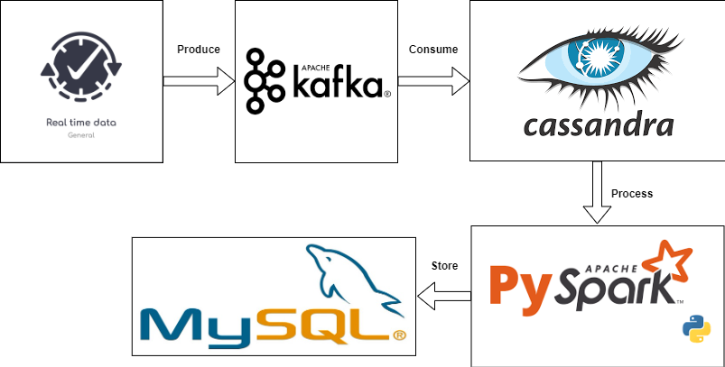

# Data recruitment pipelines project
## Objective
The primary objective of this project is to construct a system that processes and analyzes log data obtained from users of a job recruitment website. The main aim is to store, handle, examine the log data, and make decisions regarding the future direction of business growth.

To achieve this, Kafka is used as a messaging queue to transfer the raw data to Cassandra, which serves as the Data Lake. PySpark is utilized to transform the data retrieved from Cassandra, and subsequently, the processed data is stored in MySQL for data warehousing purposes. The data is then visualized using Grafana.

- keywords: **PySpark**, **Kafka**, **Cassandra**, **MySQL**, **Grafana**, **Python**.

## Architecture


### Raw Data
- Log data from the website is processed real-time into Kafka, and from Kafka saved to the Data Lake is Cassandra.
- Log data schema
```sh
.
root
 |-- create_time: string (nullable = false)
 |-- bid: integer (nullable = true)
 |-- bn: string (nullable = true)
 |-- campaign_id: integer (nullable = true)
 |-- cd: integer (nullable = true)
 |-- custom_track: string (nullable = true)
 |-- de: string (nullable = true)
 |-- dl: string (nullable = true)
 |-- dt: string (nullable = true)
 |-- ed: string (nullable = true)
 |-- ev: integer (nullable = true)
 |-- group_id: integer (nullable = true)
 |-- id: string (nullable = true)
 |-- job_id: integer (nullable = true)
 |-- md: string (nullable = true)
 |-- publisher_id: integer (nullable = true)
 |-- rl: string (nullable = true)
 |-- sr: string (nullable = true)
 |-- ts: string (nullable = true)
 |-- tz: integer (nullable = true)
 |-- ua: string (nullable = true)
 |-- uid: string (nullable = true)
 |-- utm_campaign: string (nullable = true)
 |-- utm_content: string (nullable = true)
 |-- utm_medium: string (nullable = true)
 |-- utm_source: string (nullable = true)
 |-- utm_term: string (nullable = true)
 |-- v: integer (nullable = true)
 |-- vp: string (nullable = true)
```


### Processing Data
Read and review the data recording user actions in the log data, notice that there are actions with analytical value in the column ```["custom_track"]``` including: ```clicks, conversion, qualified, unqualified```.
Processing raw data to obtain valuable clean data:
- Filter actions with analytical value in column ```["custom_track"]``` including: ```clicks, conversion, qualified, unqualified```.
- Remove null values, replace with 0 to be able to calculate.
- Calculate the basic values of data for in-depth analysis.
- Use pySpark to write Spark jobs and process data efficiently.
- Data after processing is saved to Data Warehouse is MySQL for storage and in-depth analysis.

### Clean data
- Clean Data schema
```sh
.
root
 |-- job_id: integer (nullable = true)
 |-- dates: timestamp (nullable = true)
 |-- hours: integer (nullable = true)
 |-- disqualified_application: integer (nullable = true)
 |-- qualified_application: integer (nullable = true)
 |-- conversion: integer (nullable = true)
 |-- company_id: integer (nullable = true)
 |-- group_id: integer (nullable = true)
 |-- campaign_id: integer (nullable = true)
 |-- publisher_id: integer (nullable = true)
 |-- bid_set: double (nullable = true)
 |-- clicks: integer (nullable = true)
 |-- impressions: string (nullable = true)
 |-- spend_hour: double (nullable = true)
 |-- sources: string (nullable = true)
 |-- latest_update_time: timestamp (nullable = true)
```


### Visualizing Data with Grafana

## Setup
### Pre-requisite
#### Kafka setup
- Read instructions in file ```kafka\Run kafka sever.txt```.
#### Spark setup
- Install Spark (used 3.4.0)
#### Cassandra setup
- Install Cassandra
#### MySQL setup
- Install MySQL
## Get Going!
- Setup Kafka service and start sending log data from website [Setup](setup/kafka.md)
- Setup Grafana for data visualization [Setup](setup/grafana.md)
