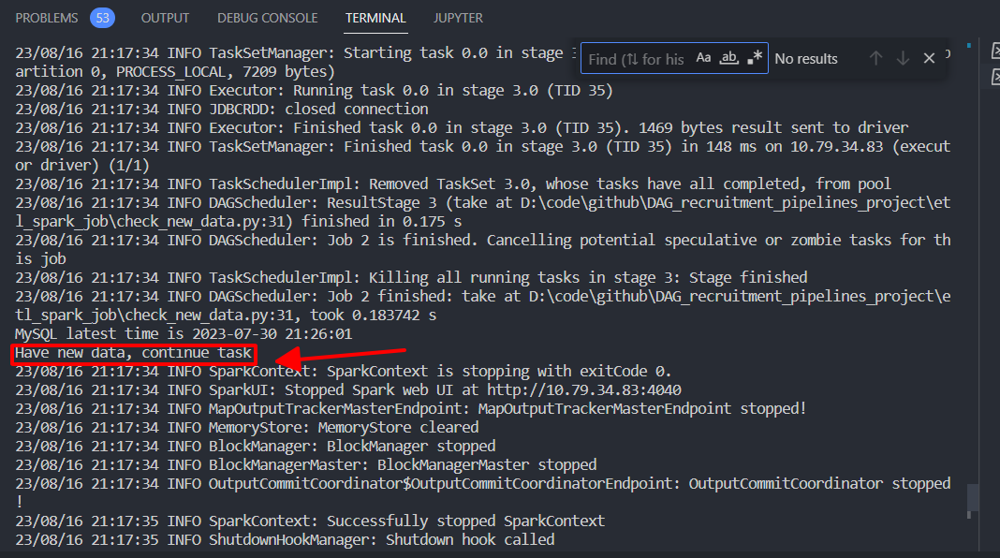

# Run Spark job
### Go to the directory of project
```#cd data_recruitment_pipelines```
### Check wether data is updated on MySQL db
``` python ETL_spark_job/check_new_data.py"```



### Update new data into MySQL db
``` python ETL_spark_job/export_newdata_to_mysql.py"```

